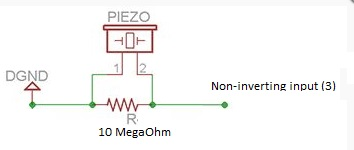

# KnockDetector

## Overview

Mechanism which protects the door from intruders with a lock that will only open when it hears one of the secret knocks set by authorized users of Android application.

## Description

The division of duties was split to several controllers. Each of them has an important function in the project.

### Detector controller

Reads analog signal from operational amplifier connected with buzzer. If readed value is under Detector_Threshold then controller start to listen to secret knock code. After three seconds of last exceedion controller validates secret code by algorithm comparing sequence of knocks with recorded data stored in database.

### Database controller

Loads data from SD card into memory and manages users and secret codes according to commands from detector controller and bluetooth controller. After every change on data it saves file on memory card. By default, can store up to 20 users. Number of users can be extended in Database_Parameters.h.

### Bluetooth controller

Receives commands from mobile application, executes them on microcontroller and sends response with OK or ERROR to application. Basic functionalities are: add/delete user, change secret code, 

### LED controller

Receives commands from detector controller and according to the result of validation lights red or green. Also lights red when person is knocking the door.

### Lock controller

After receiving Unlock command from Detector controllers sends signal to engine to open the door. Similarly, after receiving Lock command from Bluetooth controller locks the door.

## Tools

### Hardware

- STM32F4 DISCOVERY with USB cable
- Bluetooth module
- SD module
- Android mobile phone(for Android application)

### Electronic components
- Piezo speaker(buzzer)
- LED diodes: green, red
- 12V DC motor
- Resistors: 1 x 10 Mega Ohms, 2 x  220 Ohms
- Printed circuit board

### Power supply
- 12V(+5V wire) Power supply

### Software
- System Workbench for STM32
- STM Studio (optional, for debugging buzzer values)

## How to run

### Wire Connections

- Bluetooth module.

| **STM32F4 DISCOVERY** | **Bluetooth module** | 
| ----------------- | ------------------ |
| 5V | VCC |
| GND | GND |
| PC10 | RXD |
| PC11 | TXD |

- SD module.

| **STM32F4 DISCOVERY** | **SD module** | 
| ----------------- | ------------------ |
| 3V | 3V3 |
| GND | GND |
| PB11 | CS |
| PB13 | SCK |
| PB14 | MISO |
| PB15 | MOSI |

- Lock.
In the picture not all wires are correctly connected.

| **STM32F4 DISCOVERY** | **H bridge** | **Power Supply**| **Engine**|
| --------------------- | ------------ | --------------- | ----------|
| PA1 | IN1 | - | - | 
| PA2 | IN2 | - | - | 
| - | OUT1 | - | IN1 |
| - | OUT2 | - | IN2 |
| - | 12V | 12V | - |
| 5V | 5V | 5V | - |
| GND | GND | GND | - |

- Operational amplifier and buzzer.

| **STM32F4 DISCOVERY** | **Operational amplifier LM358N** | 
| ----------------- | ------------------ |
| 3V | V+ (8) |
| GND | GND (4) |
| PA0 | Output A (1) |

- LED Diodes.

| **STM32F4 DISCOVERY** | **Diodes** | 
| ----------------- | ------------------ |
| PA6 | GREEN |
| PA7 | RED |
| GND | shared GND |

### Printed circuit board

## How to compile

### Microprocessor program

:one: Clone repository to your machine.  
:two: Connect STM32F4 DISCOVERY to your PC using USB wire.  
:three: Build project in System Workbench for STM32.  
:four: Run project on your STM32F4 from Workbench.  

### Android application

## Future improvements

### :heavy_check_mark: Final version RELEASED on 8th July 2018
### :warning: This project will no longer be developed

### Known issues
:x: **Lock/Unlock mechanism is not fully implemented. Programmer has to adjust time for locking and unlocking according to lock and power of engine** 
:x: **SD module controller is not correctly implemented. Functions cause errors writing to/reading from SD card. ** 
:x: **Thresholds set in detector controller and algorithm may not work properly. Can generate false negatives ** 

## Attributions

- FatFS library for SD module (library files are mixed with project logic files in inc and src folders)

## License

- **[MIT license](http://opensource.org/licenses/mit-license.php)**

## Credits

The project was conducted during the Microprocessor Lab course held by the Institute of Control and Information Engineering, Poznan University of Technology.

Contractors: Szymon Bandowski, Przemysław Czajka, Jakub Dąbrowski

Supervisor: Tomasz Mańkowski
